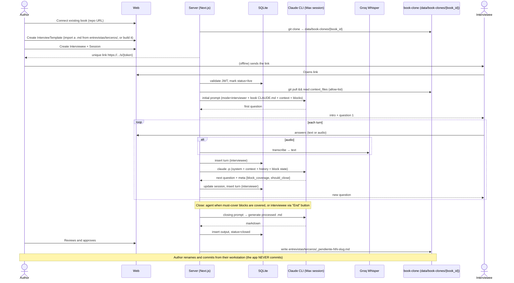

# Interview flow (MVP)



## Canonical processed-`.md` format

Mirrors the format of processed-response files in the reference book repo
(`entrevistas/<author>/NN-<slug>-respuestas.md`):

```markdown
# Entrevista NN — Respuestas: [Title]

**Entrevistado**: [Name] ([relation])
**Fecha de la sesión**: YYYY-MM-DD
**Cobertura**: bloques 1, 2, 3 (completos); bloque 4 (parcial)
**Estado**: cerrado por agente

## Bloque 1 — [title]
processed prose with verbatim quotes preserved

> "verbatim quote"

## Bloque 2 — ...

## Pendientes detectados
- ...

## Vetos del entrevistado
- Turno 14: "no usar"

<!-- FUENTES: turns 1-37 de session {id} -->
```

No YAML frontmatter — aligned with the book repo's convention. Section headings
remain in Spanish because the file is consumed by the (Spanish-language) book
repo and matches its existing files; the *file content language* is independent
of this codebase's working language.
